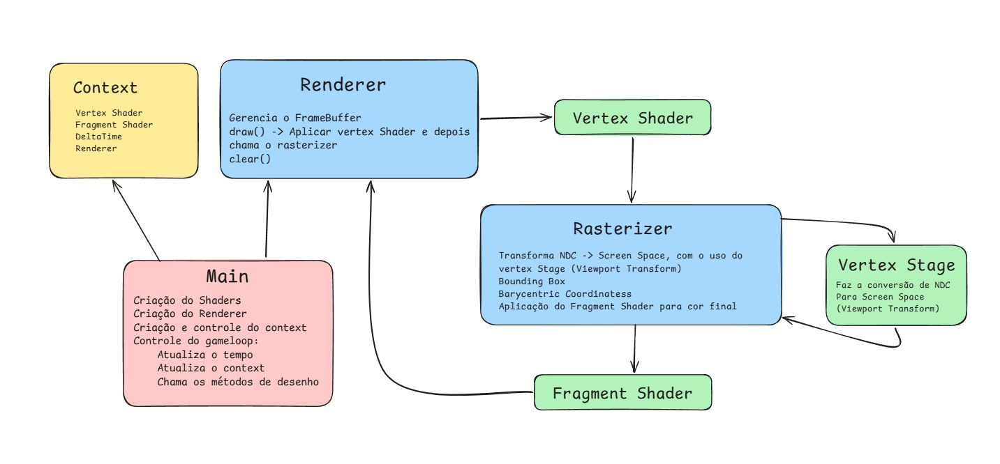

# Scene_Creator_2D
Um renderizador 2D, com algumas features (iluminação, texturas...), com capacidade de criar cenas 2D

## Arquitertura do Sistema

## Como desenhar:
usando um objeto do tipo Renderer, chama o método draw, que recebe 3 vertices em coordenadas NDC como argumentos
cujo o tipo vertex, possui dois membros -> position X,Y e color dada em RGBA de 0.0f a 1.0f. Além de
um shader de qualquer tipo que herde VertexShader

### Método draw:
usa o shader passado para ele para processar os vertex em vertexOut e os passa para o rasterizer, através do método 
drawTriangle

### Método drawTriangle: 
usa o objeto VertexStage para converter os vertexOut em NDC para screenVertex em screen space, após isso calcula a bounding
box desses vertices, para então calcular a area, e logo após calcular os pesos de cada vertice, para a verificação 
se o pixel está dentro ou fora da triangle, onde caso esteja, fazemos a interpolação das cores e ligamos o pixel através 
do objeto Renderer que o rasterizer tem instanciado

## Pipeline Atual
input de vertices em NDC -> o Vertex Shader processa eles (por enquanto não nada além de copiar) e envia em vertexOut ->
conversão de NDC para screen space no VertexStage -> Definição de posição e cor no rasterizer
-> Desenho dos vertices no Renderer

## Shaders

### Sin Vertex Shader
Faz o triangulo ondular através da formula: v.position.y + std::sin(time * 15.0f - v.position.x * 15.0f) * 0.25f

### Sin Fragment Shader
Gera uma onda azul no triangulo, que vai da direita para esquerda, 
com a seguinte formula: 0.5f + 0.5f * std::sin(frag.position.x * 0.1f + ctx.time * 15.0f);
 